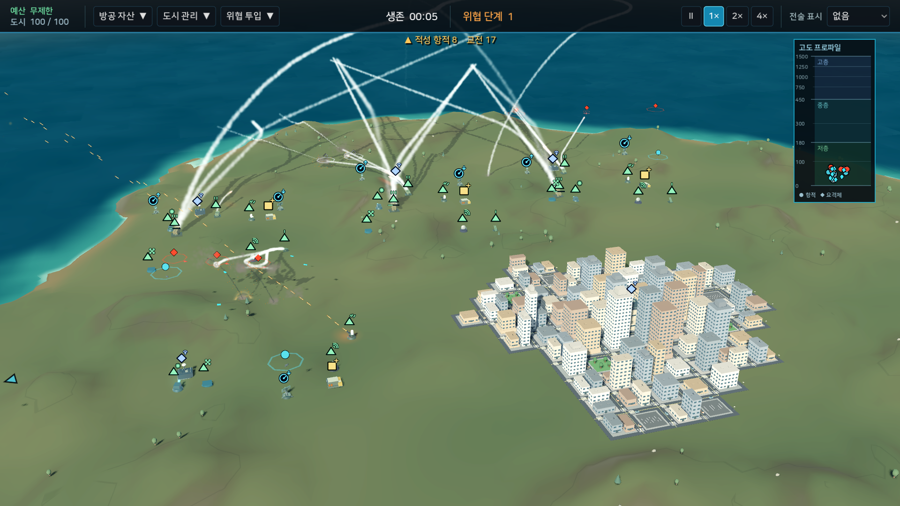

# Airscain

> 불완전한 정보 속에서 방공망을 설계하고, 끊임없는 복합 공습으로부터 섬 도시를 지키는 3D 실시간 전략 게임.



Airscain에서는 개별 무기를 직접 조종하는 대신 센서, 지휘통제, 요격체계와 지원시설을 하나의 방공망으로 연결해 운용합니다. 레이더가 실제 위협을 관측해 항적을 만들고, 공유된 정보와 교전규칙에 따라 적합한 방어체계가 자동으로 대응합니다.

전장은 매번 새로운 지형과 해안선, 도심을 생성합니다. 적은 단순히 수만 늘리지 않고 정찰, 기만, 포화 공격, 방공망 제압과 시설 타격을 조합하며 플레이어의 배치와 이전 교전 결과에 반응합니다. 최종 승리 지점은 없으며 도시 기능이 다할 때까지 방공망을 확장하고 유지하는 것이 목표입니다.

## 핵심 플레이

- 절차적으로 생성되는 섬 지형과 고밀도 로우 폴리 도시
- 실제 객체와 플레이어가 인식한 항적을 분리한 불완전 정보 체계
- 탐지, 추적, 분류, IFF와 지휘통제망을 거치는 자동교전
- 장거리, 중거리, 단거리 미사일과 기관포, 레이저, HPM, 요격 드론으로 구성하는 다층 방어
- 탄약, 전력, 과열, 손상, 재보급과 수리를 고려한 장기 운용
- 정찰, 전자전, 기만, SEAD, 순항 및 탄도 위협을 조합한 복합 공격 편성
- 전술 오버레이, 항적 관계선과 고도 프로파일을 이용한 상황 판단
- 전장 상태와 방어 성과에 적응하는 지속형 공격 흐름

## 작전 흐름

```text
전장 파악과 자산 배치
→ 센서 탐지와 항적 형성
→ 지휘통제망을 통한 정보 공유
→ 교전규칙에 따른 다층 요격
→ 피해 복구, 재보급과 재배치
→ 방공망 확장과 다음 공격 대응
```

예산은 새 방공 자산을 구매하거나 도시 기능을 복구하는 데 사용합니다. 강력한 장비 하나를 반복 배치하기보다 탐지 고도, 교전 거리, 표적 특성, 탄약과 전력 조건이 다른 장비를 연결하고 서로의 빈틈을 보완해야 합니다.

## 게임 모드

| 모드 | 내용 |
|---|---|
| 지속 작전 | 예산과 방공망을 관리하며 점점 복잡해지는 공습에 최대한 오래 버팁니다. 저장과 불러오기를 지원합니다. |
| 훈련 | 카메라, 배치, 탐지, 교전, 지원과 전술 오버레이를 실제 플레이 흐름으로 익힙니다. |
| 샌드박스 | 자산과 위협을 자유롭게 배치해 방어 조합과 교전 결과를 시험합니다. |

## 실행

현재 저장소는 개발용 소스 실행을 기준으로 합니다. [Godot 4.7.2](https://godotengine.org/)가 필요하며 `godot` 명령을 `PATH`에서 실행할 수 있어야 합니다.

새로 clone하거나 pull한 뒤 프로젝트 파일이 추가되거나 이동된 경우 먼저 Godot 메타데이터를 생성합니다.

```bash
godot --headless --audio-driver Dummy --editor --path . --quit
```

초기화가 끝나면 게임을 실행합니다.

```bash
godot --path .
```

## 조작

| 입력 | 동작 |
|---|---|
| `W` `A` `S` `D` | 화면 방향을 기준으로 카메라 이동 |
| 마우스 휠 | 확대 및 축소 |
| 마우스 가운데 버튼 드래그 | 카메라 이동 |
| `Q` `E` | 카메라 회전 |
| 마우스 오른쪽 버튼 드래그 | 카메라 회전 |
| 마우스 왼쪽 버튼 | 자산이나 항적 선택 또는 배치 확정 |
| 마우스 오른쪽 버튼 / `Esc` | 현재 배치 취소 |
| `Esc` | 작전 메뉴 열기 |

시간 정지와 1×, 2×, 4× 배속은 화면 오른쪽 위에서 선택합니다. 지속 작전의 저장은 작전 메뉴에서, 불러오기는 메인 메뉴와 작전 메뉴에서 사용할 수 있습니다.

## 개발과 검증

프로젝트는 Godot 4.7.2와 typed GDScript를 사용하며, 네이티브와 웹 모두 같은 Compatibility 렌더러 설정으로 실행됩니다. GUT 테스트 도구는 저장소에 포함되어 있습니다.

```bash
godot --headless --audio-driver Dummy --path . \
  -s addons/gut/gut_cmdln.gd \
  -gdir=res://tests -ginclude_subdirs -gexit
```

## GitHub Pages 배포

`main` 브랜치에 push하면 GitHub Actions가 Godot 4.7.2와 공식 export template을 받아 단일 스레드 Web 빌드를 만들고 GitHub Pages에 배포합니다. 저장소의 **Settings → Pages → Build and deployment → Source**를 **GitHub Actions**로 한 번 지정해야 합니다. 이후 배포 주소는 `Deploy to GitHub Pages` workflow의 deployment에서 확인할 수 있습니다.

로컬에 Godot Web export template이 설치되어 있다면 같은 산출물을 다음 명령으로 만들 수 있습니다.

```bash
mkdir -p build/web
godot --headless --audio-driver Dummy --path . \
  --export-release Web build/web/index.html
```

웹 빌드는 파일을 직접 열지 말고 HTTP 서버를 통해 실행해야 합니다. 예를 들어 저장소 루트에서 다음과 같이 확인합니다.

```bash
python3 -m http.server 8060 --directory build/web
```

## 문서

- [게임 요구사항](docs/SPEC.md)
- [기술 설계](docs/TECH.md)
- [구현 계획과 검증 기록](docs/PLAN.md)
- [에이전트 작업 지침](AGENTS.md)
