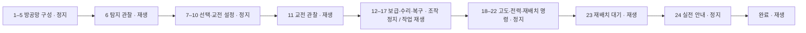

# 훈련 시나리오·화면 대본 검토본

현재 구현을 기준으로 전체 흐름, 실제 화면 대사, 완료 조건과 개선 후보를 모았다. **이 문서는 검토용이며 아래 제안은 아직 게임에 적용하지 않았다.** 요구사항은 [SPEC.md](SPEC.md), 설계는 [TECH.md](TECH.md)가 기준이다. 문구나 조건을 바꿀 때는 이 문서와 구현을 함께 갱신한다.

## 1. 전체 흐름

**기초 방공망 1–5 → 첫 교전 6–11 → 군수·복구 12–17 → 운용 확장 18–23 → 실전 안내 24 → 완료**

- 로딩 완료 후 실행 상태로 진입하고 즉시 자동 일시정지한다. 별도 ‘방어 시작’ 버튼은 없다.
- 초기 예산은 2,500이고 도시 기본 지휘통제소가 제공된다. 훈련 저장·불러오기는 지원하지 않는다.
- 자폭형 공격 UAV 한 기를 동쪽 약 5.4km에서 생성한다. 기본 속도는 30m/s이며 일반 공습은 진행하지 않는다.
- 안내·배치·설정 중에는 정지, 탐지·교전·작업 결과 관찰 중에는 재생한다. 자동 재생에 들어갈 때는 1×이며, 대기 단계의 4×는 추천 표시다.
- 표적은 초기 배치가 끝날 때까지 움직이지 않는다. 5단계의 C2 연결 확인 후부터 접근한다.
- 완료는 별도 내부 상태지만 화면에서는 마지막 단계와 같은 **24/24**로 표시한다.

## 2. 단계별 검토표

정지/재생은 자동 전환되는 기본 상태다. 사용자가 시간 제어 버튼을 직접 누르는 것까지 차단하지는 않는다. ‘다음으로 넘어가는 조건’은 대사의 의도와 별도로 **현재 코드가 실제 검사하는 조건**을 적었다.

| 단계 / 코드 | 화면 제목 | 시간 | 플레이어 행동 | 다음으로 넘어가는 조건 | 화면 강조 |
| --- | --- | --- | --- | --- | --- |
| 1 · `CAMERA` | 전장 살펴보기 | 정지 | 카메라 조작 후 계속 | 계속 버튼 클릭 | 다음 단계 버튼 |
| 2 · `RADAR` | 저·중고도 레이더 | 정지 | 저·중고도 레이더 배치 | search_radar 배치 성공 | 자산 메뉴 → 레이더 → 추천 위치 |
| 3 · `COMMAND` | 도시 지휘통제소 | 정지 | 도시 기본 지휘통제소 선택 | 도시 중앙의 기본 지휘통제소 선택 | 기본 지휘통제소 |
| 4 · `WEAPON` | 요격 계층 | 정지 | 미사일 포대 배치 | MissileBattery 배치 성공; 훈련 포대로 기록하고 사격중지 | 자산 메뉴 → 미사일 포대 → 추천 위치 |
| 5 · `CONNECT` | C2 연결 확인 | 정지 | 레이더–지휘통제소–포대 연결 확인 | 훈련 포대에서 저·중고도 레이더까지 C2 경로가 있으면 자동 진행 | 별도 강조 없음; 안내문과 연결선 |
| 6 · `ACQUIRE` | 탐지 관찰 · 자동 재생 | 재생 1× | 항적이 만들어지는 과정 관찰 | 선택 가능한 적성 항적이 생기면 자동 정지 | 1× 버튼 |
| 7 · `SELECT_TRACK` | 항적 선택 · 일시정지 | 정지 | 적성 항적 선택 | 코드상 null이 아닌 항적 선택 | 확인된 적성 항적 표식 |
| 8 · `SELECT_ASSET` | 방어자산 선택 | 정지 | 배치한 미사일 포대 선택 | 훈련 포대 선택 | 훈련 포대 |
| 9 · `TARGET_POLICY` | 교전 정책 | 정지 | 로켓 교전 차단, UAV 교전 허용 | 훈련 포대의 UAV 허용·로켓 차단 상태 | 포대 → 로켓 교전 토글 |
| 10 · `DOCTRINE` | 자동교전 허용 | 정지 | 훈련 포대 사격중지 해제 | 훈련 포대의 사격중지 해제 | 포대 → 사격중지 토글 |
| 11 · `ENGAGE` | 자동교전 · 자동 재생 | 재생 1× | 발사와 요격 관찰 | 훈련 표적의 요격 또는 임무 종료 | 1× 버튼 |
| 12 · `SUPPORT` | 통합 지원기지 | 정지 | 포대를 지원하는 지원기지 배치 | 지원 반경에 훈련 포대를 포함하는 지원 자산 배치/재배치 완료 | 지원기지 → 추천 위치 |
| 13 · `RESUPPLY` | 재보급 요청 | 정지 | 훈련 포대 재보급 요청 | 훈련 포대의 재보급 요청 접수 | 포대 → 재보급 버튼 |
| 14 · `WAIT_RESUPPLY` | 보급 완료 관찰 · 재생 | 재생 1× | 재보급 완료 대기 | 훈련 포대 재보급 완료 | 4× 버튼을 추천 |
| 15 · `REPAIR` | 시설 수리 · 일시정지 | 정지 | 훈련 포대 수리 요청 | 훈련 포대의 수리 요청 접수 | 포대 → 수리 버튼 |
| 16 · `WAIT_REPAIR` | 수리 완료 관찰 · 재생 | 재생 1× | 수리 완료 대기 | 훈련 포대 수리 완료 | 4× 버튼을 추천 |
| 17 · `CITY_RESTORE` | 도시 기능 복구 | 정지 | 도시 기능 복구 | 도시 복구 실행 성공 | 도시 관리 → 피해 복구 |
| 18 · `OVERLAY` | 방공망 점검 | 정지 | 지휘 연결 오버레이 선택 | 전술 표시 c2 선택 | 전술 표시 드롭다운 |
| 19 · `ALTITUDE` | 고도별 탐지 계층 | 정지 | 고고도 레이더 배치 | tracking_radar 배치 성공; 재배치 대상으로 기록 | 고고도 레이더 → 추천 위치 |
| 20 · `ENERGY` | 전력 기반 방어 | 정지 | 에너지 무기 배치 | 전력 수요가 있는 자산 배치 성공; 검토 대상으로 기록 | 고출력 레이저 → 추천 위치 |
| 21 · `ENERGY_REVIEW` | 충전과 열 확인 | 정지 | 배치한 에너지 무기의 전력·충전·열 확인 | 해당 자산을 선택한 뒤 계속 클릭 | 에너지 자산 → 계속 버튼 |
| 22 · `RELOCATE` | 센서 재배치 | 정지 | 고고도 레이더 재배치 | 19단계 레이더의 재배치 시작 | 레이더 → 재배치 → 새 위치 |
| 23 · `WAIT_RELOCATE` | 재배치 완료 관찰 · 재생 | 재생 1× | 철수·설치 완료 대기 | 19단계 레이더의 재배치 완료 | 4× 버튼을 추천 |
| 24 · `OPERATIONS` | 다음 작전 준비 | 정지 | 실전·자유 모드 안내 확인 | 계속 버튼 클릭 | 계속 버튼 |
| 완료 · `COMPLETE` | 훈련 완료 | 재생 1× | 자유 연습 또는 메뉴 복귀 | 후속 단계 없음 | 추가 강조 없음 |

## 3. 자동 연출과 상태 변경

| 시점 | 게임이 자동으로 하는 일 |
| --- | --- |
| 진입 | 작전 실행 상태 진입, 속도 0, 표적 1기 생성, 주황색 진입 회랑 표시 |
| 훈련 포대 배치 | 해당 포대를 교육 대상으로 기억하고 사격중지를 켬 |
| C2 연결 확인 | 자산 메뉴를 접고 진입 회랑을 숨김, 속도 1로 전환 |
| 항적 획득 | 속도 0으로 전환하고 항적 선택 안내 |
| 사격중지 해제 | 속도 1로 전환 |
| 훈련 표적 종료 | 속도 0으로 전환하고 지원기지 배치 안내; 격추만을 성공 조건으로 삼지는 않음 |
| 지원기지 조건 충족 | 훈련 포대의 모든 예비탄을 0으로 만들어 보급을 연습시킴; 선택 해제 |
| 재보급 완료 | 속도 0으로 전환, 훈련 포대 최대 내구도의 25% 피해 적용 |
| 수리 완료 | 속도 0으로 전환, 복구 실습에 필요한 도시 피해가 부족하면 복구 1회분 피해 적용 |
| 지휘 연결 오버레이 선택 | 위협/해금 단계를 3으로 올려 후반 장비를 사용할 수 있게 함 |
| 에너지 무기 배치 | 교육 대상으로 기억하고 선택 해제; 자산 메뉴 접기 |
| 에너지 무기 선택 | 추가 설명과 계속 버튼 표시; 충전·열 수치가 실제로 변하는지는 완료 조건에 없음 |
| 재배치 완료 | 속도 0으로 전환, 마지막 안내 표시 |
| 훈련 완료 | 속도 1로 전환; 일반 자동 공습은 계속 꺼져 있음 |

## 4. 현재 화면 대본

아래 인용문은 `TrainingController._set_step()`의 실제 제목·대사를 그대로 정리했다. 동적 메시지는 별도로 표시한다.

### 01. 전장 살펴보기 — `CAMERA`

> 작전은 이미 시작됐으며 안내와 배치를 위해 자동 일시정지했습니다. 레이더·지휘통제소·포대가 연결되면 자동 재생됩니다. 실전에서는 우측 상단 일시정지를 직접 사용할 수 있습니다.
>
> WASD · 이동
> 가운데 버튼 드래그 · 수평·수직 회전
> Q/E · 수평 회전
> 휠 · 확대·축소
> Backspace · 위치·줌·각도 초기화
>
> 주황색 훈련 표적 진입 표시를 찾아보세요.

버튼: **확인, 다음 단계**.

### 02. 저·중고도 레이더 — `RADAR`

> 상단의 방공 자산을 열어 저·중고도 레이더를 고르세요. 도시와 주황색 진입 표시 사이의 평탄한 지형에 배치하세요. 산 뒤에는 저고도 탐지 사각이 생깁니다.

### 03. 도시 지휘통제소 — `COMMAND`

> 도시 중앙 건물 옥상의 지휘통제소를 선택하세요. 처음부터 무료로 제공되며 연결된 센서의 항적을 포대에 전달합니다. 망을 넓힐 때는 지휘통제소를 추가 설치할 수 있습니다.

### 04. 요격 계층 — `WEAPON`

> 미사일 포대를 도시와 주황색 진입 표시 사이, 지휘통제망 안에 배치하세요. 포대는 사격중지 상태로 준비됩니다. 배치 모드는 우클릭이나 Esc로 종료합니다.

### 05. C2 연결 확인 — `CONNECT`

> 레이더 → 지휘통제소 → 포대의 청색 연결선을 확인하세요. 연결될 때까지 자동 일시정지를 유지하고, 연결되면 자동 재생해 탐지 관찰로 진행합니다. 연결이 끊겼다면 지휘통제소를 추가하거나 자산을 재배치하세요.

### 06. 탐지 관찰 · 자동 재생 — `ACQUIRE`

> 실제 물체가 보여도 방공망이 탐지하기 전에는 교전할 수 없습니다. 잠정 항적이 확인 항적으로 바뀌면 자동 일시정지됩니다.

### 07. 항적 선택 · 일시정지 — `SELECT_TRACK`

> 적성 항적 표식을 클릭하세요. 화면 밖 가장자리 표식도 선택할 수 있습니다. 추적 품질과 분류 확신도는 서로 다른 정보입니다.

### 08. 방어자산 선택 — `SELECT_ASSET`

> 배치한 미사일 포대를 클릭하세요. 선택 패널에서 탄약과 C2 연결, 사격중지 상태를 확인할 수 있습니다.

### 09. 교전 정책 — `TARGET_POLICY`

> 교전 설정 바로 아래의 로켓 아이콘을 눌러 로켓 교전을 차단해 보세요. 밝은 청록색 테두리는 허용, 어두운 아이콘은 차단입니다. 다시 누르면 허용됩니다. 훈련 표적인 무인기는 허용 상태로 두세요.

### 10. 자동교전 허용 — `DOCTRINE`

> 미사일 포대를 다시 클릭하고 사격중지를 해제하세요. 해제하면 자동 재생됩니다. 미확인 교전은 분류가 불충분한 물체까지 허용하므로 신중하게 사용하세요.

### 11. 자동교전 · 자동 재생 — `ENGAGE`

> 포대의 선회, 발사관 사출과 요격을 관찰하세요. 표적이 요격되거나 임무를 마치면 자동 일시정지됩니다.

### 12. 통합 지원기지 — `SUPPORT`

> 방공 자산을 열어 통합 지원기지를 배치하세요. 포대에 녹색 지원선이 연결되어야 합니다. 지역 보급·수리는 260m 안에서만 가능하며 예비탄 소진을 훈련합니다.

범위 밖에 배치했을 때: “포대까지 녹색 지원선이 연결되는 범위 안에 지원기지를 배치하세요.”

### 13. 재보급 요청 — `RESUPPLY`

> 포대를 다시 선택하고 재보급 요청을 누르세요. 요청은 예산을 사용해 지원 대기열에 작업을 넣습니다. 완료까지 시간이 필요합니다.

### 14. 보급 완료 관찰 · 재생 — `WAIT_RESUPPLY`

> 선택 패널의 보급 작업과 탄약을 관찰하세요. 2×·4×로 대기를 줄일 수 있습니다. 보급 완료 후 정지하고 수리 실습용으로 포대에 경미한 손상을 적용합니다.

### 15. 시설 수리 · 일시정지 — `REPAIR`

> 손상은 가동 효율을 낮춥니다. 포대를 선택해 수리 요청을 누르세요. 수리도 같은 지역 지원기지의 작업 용량을 사용합니다.

### 16. 수리 완료 관찰 · 재생 — `WAIT_REPAIR`

> 지원기지가 포대를 수리하고 있습니다. 가동 상태가 회복되면 자동 정지하고, 다음 도시 복구 실습을 위한 경미한 도시 피해를 적용합니다.

### 17. 도시 기능 복구 — `CITY_RESTORE`

> 상단 도시 관리를 열고 피해 복구를 누르세요. 도시 복구는 예산을 지불하면 즉시 적용됩니다. 포대 수리와는 별개이며 전투 중에도 사용할 수 있습니다.

### 18. 방공망 점검 — `OVERLAY`

> 우측 상단 전술 표시에서 지휘 연결을 선택하세요. 탐지 범위·사거리·지원 범위도 목록에서 바로 선택할 수 있습니다.

### 19. 고도별 탐지 계층 — `ALTITUDE`

> 고급 장비를 훈련용으로 해금했습니다. 고고도 레이더를 배치하세요. 120–1500m를 감시하며 저·중고도 레이더와 역할이 다릅니다. 오른쪽 고도 프로파일로 탐지 높이를 확인하세요.

### 20. 전력 기반 방어 — `ENERGY`

> 고출력 레이저를 배치하세요. 커서 옆 전력 수요·공급과 배치 후 수치를 확인하세요. 통합 지원기지의 전력은 거리 제한 없는 전역 공급입니다.

### 21. 충전과 열 확인 — `ENERGY_REVIEW`

> 방금 배치한 에너지 무기를 선택하세요. 충전·열·전체 수요/공급을 확인하면 다음 단계로 진행할 수 있습니다.

대상 자산 선택 후 제목: **전력과 열 확인**. 계속 버튼을 표시한다.

> 선택 패널에서 전력 수요/공급, 충전과 열을 확인하세요. 전력은 전체 자산의 합계이고 보급·수리는 지역 지원입니다. 수요가 공급보다 크면 일부 자산의 충전이 느려집니다.

### 22. 센서 재배치 — `RELOCATE`

> 배치한 고고도 레이더를 선택하고 재배치 위치 지정을 누른 뒤 다른 빈 지점을 클릭하세요. 이동 중에는 센서가 가동하지 않습니다. 새 위치에서도 C2 연결을 유지하세요.

### 23. 재배치 완료 관찰 · 재생 — `WAIT_RELOCATE`

> 철수와 재설치가 진행 중입니다. 시간이 끝나면 센서가 새 위치에서 다시 가동하고 훈련이 일시정지됩니다.

### 24. 다음 작전 준비 — `OPERATIONS`

> 장거리는 고가 탄약과 탄종, 근거리는 기관포·레이저로 역할을 나누세요. 지속 작전은 Esc에서 저장하고 메뉴에서 이어갈 수 있습니다. 자유 모드에서는 위협을 직접 투입해 조합을 시험합니다.

버튼: **확인, 다음 단계**.

### 완료. 훈련 완료 — `COMPLETE`

> 탐지·C2·교전 정책·자동교전, 보급·수리·도시 복구, 고도 계층·전력·재배치를 마쳤습니다. 자유롭게 연습하거나 Esc로 돌아가 지속 작전을 시작하세요.

## 5. 우선 검토할 개선 후보 — 미적용

| 우선순위 | 관찰된 점 | 개선 방향 | 함께 결정할 사항 |
| --- | --- | --- | --- |
| 높음 | 배치 중에 적도 정지하므로 배치를 끝낸 뒤 약 5.4km부터 접근한다. 실전과 출발 조건은 같지만 6단계에서 다시 긴 대기가 생길 수 있다. | 첫 탐지 대기 구간만 자동 배속하고 탐지 근처에서 1×로 복귀하는 방안 검토 | 실전 속도 체험과 기다림 축소 중 무엇을 우선할지; 배속 전환 안내 |
| 높음 | 첫 안내에 자동 시간 제어·카메라 조작 5종·진입 방향 찾기가 한꺼번에 들어간다. | 상시 대사는 ‘이번에 할 행동’ 1–2문장으로 줄이고 조작표는 별도 도움말로 분리 | 카메라 조작을 실제로 확인할지, 지금처럼 계속만 눌러도 통과할지 |
| 높음 | 5단계는 연결이 이미 정상이라면 바로 지나가고, 끊겼다면 문구만 남는다. | 연결 성공 시 짧은 피드백, 실패 시 끊긴 구간과 보완할 자산을 강조 | 3단계 기본 지휘통제소 선택과 5단계 연결 확인의 역할 분담 |
| 높음 | 6단계는 적성 항적을 기다리지만 7단계 완료 조건은 아무 항적이나 선택하는 것이다. | 강조되는 항적과 완료 조건을 같은 공개 항적 기준으로 맞춤 | 확인/적성/훈련 대상 중 필요한 조건 |
| 중간 | 실제 표적은 UAV인데 9단계는 로켓 교전을 끈다. 결과 차이를 전투에서 관찰하기 어렵다. | 허용/차단의 효과를 관찰하는 짧은 예시를 넣거나 해당 정책 실습을 심화로 이동 | 첫 교전 전에 정책 설정을 얼마나 가르칠지 |
| 중간 | 12–17단계는 조작 3번과 완료 대기를 여러 카드로 나눠 전체 훈련의 1/4을 차지한다. | ‘보급 → 수리 → 도시 복구’ 한 묶음으로 표시하고 진행중/완료 상태를 카드 안에서 전환 | 24단계 번호를 유지할지, 교육 단원 중심으로 바꿀지 |
| 중간 | 예비탄 고갈·시설 피해·도시 피해를 스크립트가 만든다. 설명을 지나치면 실제 전투 피해로 오해할 수 있다. | 적용 순간 ‘훈련용 고갈/피해 적용’ 메시지를 짧게 표시 | 연습용 변경과 실제 전투 결과의 구분 방식 |
| 중간 | 19단계와 21단계는 고도·충전·열을 설명하지만 실제 고도별 탐지 차이나 에너지 교전을 관찰하지 않는다. | 짧은 실증을 추가하거나 설명만 하는 단계는 심화 훈련으로 분리 | 기본 훈련을 짧게 유지할지, 한 번에 모두 학습할지 |
| 낮음 | 마지막 안내와 완료가 모두 24/24로 표시되고, 완료 후에는 새 적이 오지 않는다. | 완료를 진행 번호와 분리하고 실전/자유 모드로 이어지는 선택을 명확히 함 | ‘자유 연습’에 새 표적 투입도 포함할지 |

접근 대기는 코드상 생성 거리 5.4km, 기본 속도 30m/s, 레이더 반경 700m의 조합을 근거로 한 검토 사항이다. 실제 탐지 시간은 레이더 배치·지형·표적 경로에 따라 달라지므로 고정 소요 시간으로 단정하지 않는다.

## 6. 시나리오를 수정할 때 볼 코드

| 수정할 내용 | 구현 위치 | 주의할 연결 |
| --- | --- | --- |
| 단계 ID·순서·진행률 | [training_controller.gd](../main/training_controller.gd) `Step`, `LESSON_COUNT` | Guidance 분기, 전환 함수, 테스트, 이 문서의 표와 번호 |
| 화면 제목·대본 | 같은 파일 `_set_step()`, `_lesson()` | `asset_selected()`의 에너지 자산 선택 후 대사는 별도 |
| 완료 조건·다음 단계 | 같은 파일 각 사건 처리 함수 | 배치·선택·지원 완료·재배치 완료 등 서로 다른 사건으로 진행 |
| 자동 정지·재생 | 같은 파일의 `set_simulation_speed()` 호출 | 현재 정책이 사건 처리 함수에 나뉘어 있음; 단계별 데이터로 모으는 것은 후속 리팩터링 후보 |
| 교육용 예산·진입 시점 | [main.gd](../main/main.gd) `_ready()`, `_prepare_combat_visuals()` | 예열 완료 뒤 `begin()` 호출; 기본 지휘통제소는 먼저 배치 |
| 표적 선정·생성 | Controller `_spawn_training_threat()`, `approach_position()` | 현재 시나리오의 `threat_entries[0]`에 의존; 편성 순서를 바꾸면 훈련 표적도 바뀜 |
| 버튼·자산·위치 강조 | [training_guidance.gd](../ui/training_guidance.gd) `PLACEMENT_LESSONS`, `refresh()` | Controller의 통과 조건보다 강조 대상이 더 구체적인 단계가 있음 |
| 훈련 카드와 진행 표시 | [hud.gd](../ui/hud.gd) `set_training_lesson()` | 실제 번호는 `min(step, LESSON_COUNT)`로 제한 |
| 실제 사건 전달·항적 집계 | [main.gd](../main/main.gd) `_connect_flow()`, `_refresh_tactical_ui()` | 선택 가능한 적성 항적 수를 Controller로 전달 |

## 7. 수정 후 확인할 항목

- 초기에는 실행 상태·속도 0이며 시작 버튼이 없고, 기다려도 표적 위치와 시간이 그대로인지.
- 레이더·포대가 끊겨 있을 때 5단계에서 대기하고, 연결되면 한 번만 재생하며 표적을 중복 생성하지 않는지.
- 항적 선택은 화면 밖 표식에서도 가능하고, 안내·강조 대상과 완료 조건이 일치하는지.
- 재보급·수리·재배치는 요청 시점과 완료 시점을 구분하는지.
- 훈련용 고갈·피해와 해금이 의도한 시점에 한 번만 적용되는지.
- 카드가 메뉴·선택 패널·화면 가장자리를 가리지 않는지.
- 실제 교전부터 마지막 완료까지 이어지는지.

현재 검증 경로: [playable 통합 테스트](../tests/integration/test_playable_flow.gd)의 `test_training_mode_guides_real_deployment_flow_and_disables_saves`, [안내 통합 테스트](../tests/integration/test_training_guidance.gd), [실제 창 시나리오 실행](../tools/training_quality_capture.gd).
